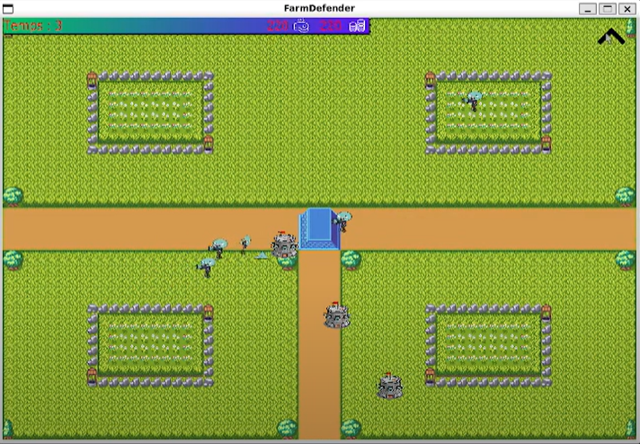

# Farm Defender

## Description
"Farm Defender" est un jeu captivant en C++ pour Linux. Protégez vos fermes et l'hôtel de ville contre des vagues de zombies. Choisissez stratégiquement vos tours, évoluez-les et gérez les ressources. Affrontez des hordes toujours plus puissantes. Un défi tactique palpitant dans un monde apocalyptique.

## Comment exécuter le jeu
1. Assurez-vous que vous disposez du compilateur C++ sur votre système.
2. Téléchargez le code source du jeu.
3. Utilisez le makefile fourni pour compiler le jeu.
4. Exécutez l'exécutable généré.

# Diagramme de Classe

Le diagramme de classe ci-dessus représente la structure des classes utilisées dans le projet.

## Manuel du jeu
### Principe et règles du jeu
- Options : Jouer, Option, Crédit.
- Jouer : Nouvelle sauvegarde et tutoriel.
- Option : Ajustez le son et la langue.
- Crédits : Affiche les noms des développeurs.

### MAP
- Trois chemins principaux : OUEST, EST, SUD.
- La ferme principale est au centre.

### GAMEPLAY
- Survivez aux vagues de zombies.
- Protégez la ferme principale.
- Construisez des tours et des fermes.
- Gérez les ressources pour survivre.

### Menu
- Appuyez sur "m" pour le menu (ouverture et fermeture).
- Dans la boutique, achetez des bâtiments et améliorations.

## Capture

## Vidéo de Prévisualisation

Cliquez sur l'image ci-dessus pour regarder la vidéo de prévisualisation.

## Licence

Ce projet est sous licence GNU AGPLv3. Consultez le fichier [LICENSE](LICENSE) pour plus de détails.
